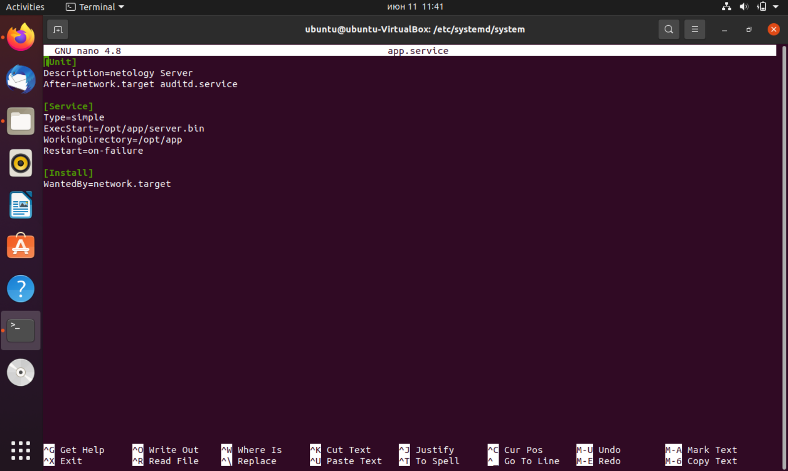
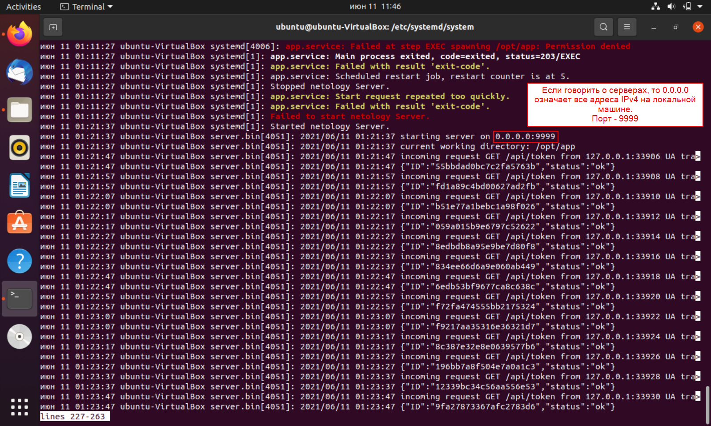
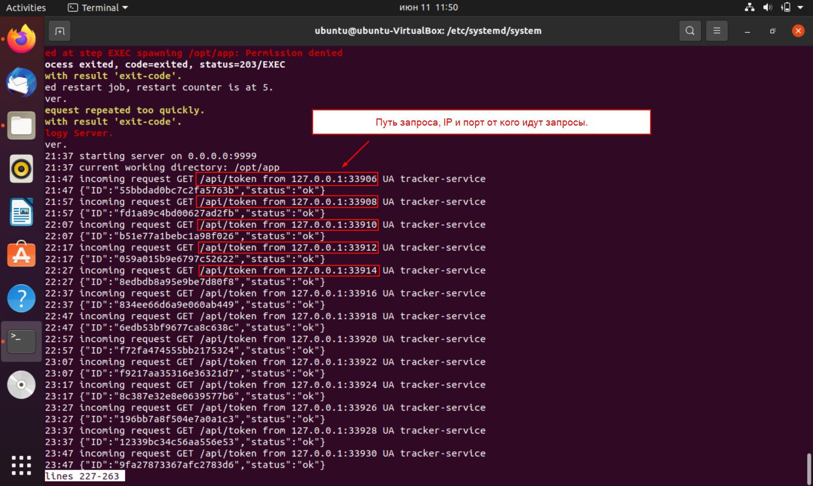
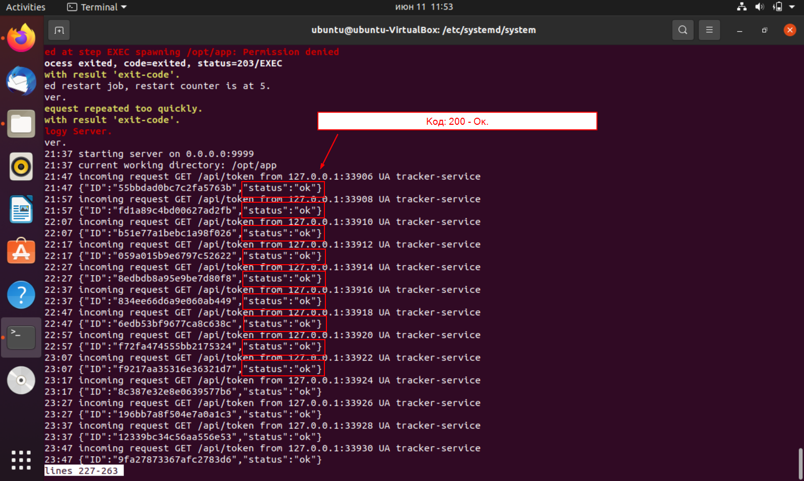
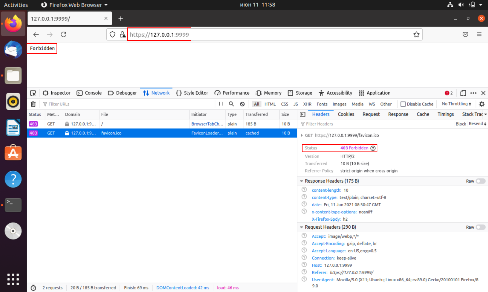

# 1. Скриншот, либо содержимое файла app.service

# 2. Ответы на впоросы:

## На каком IP и порту запускается сервис:

## Кто (IP и порт) шлёт запросы на этот сервис и на какой путь:

## Какие ответы (формат) получает клиент из п.ii получает в ответ на свои запросы:

## Какой ответ (HTTP статус код) получите вы, если пошлёте из браузера запрос на этот же адрес (сертификат самоподписанный, поэтому вам необходимо принять его):

